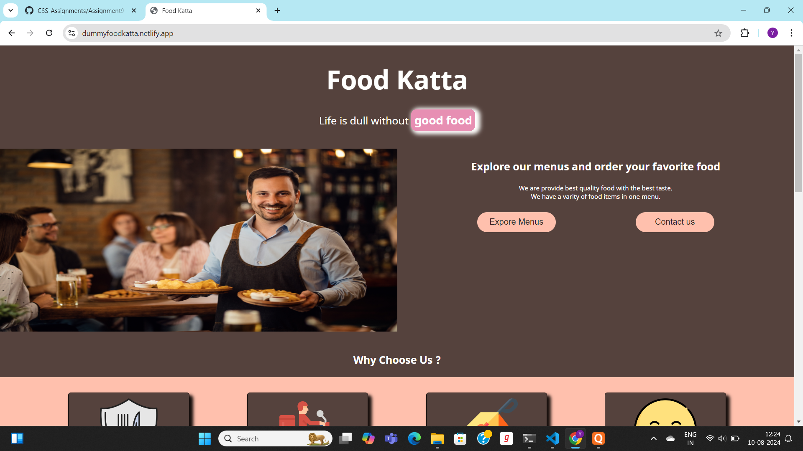
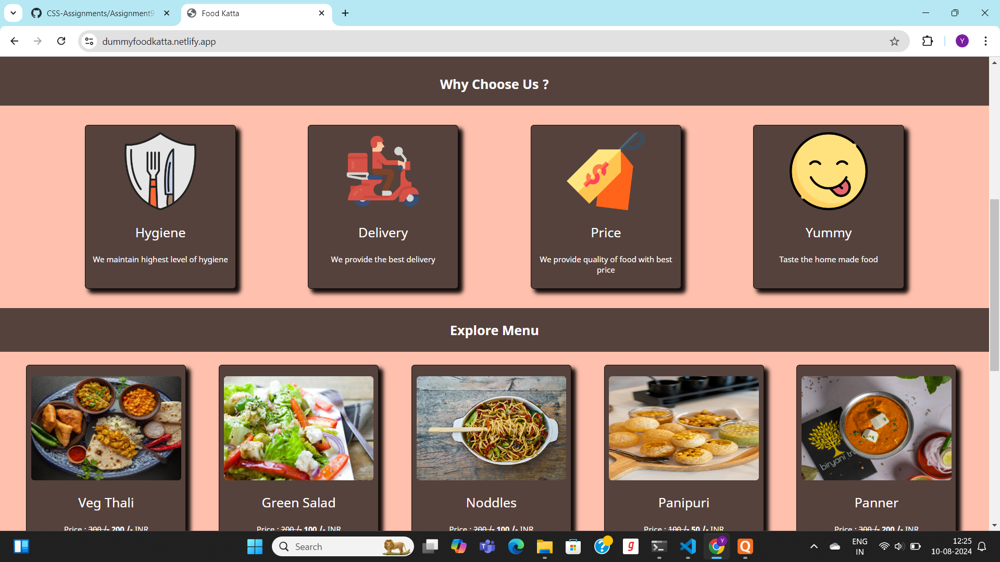
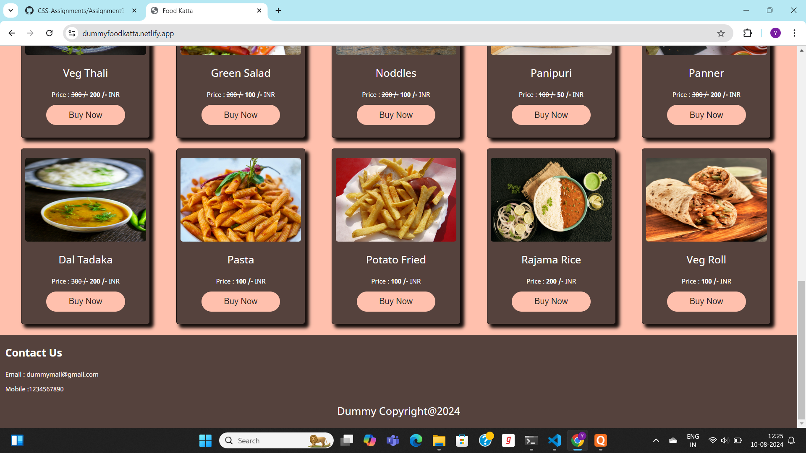

## **Food Katta** ##

## Information About Food Katta ##

- **Summery Of Page** : This assignment content one page i.e index.html.We use two ways to implant css on wepages.i.e External and Internal  CSS respectivly. We use various properties of css like background-color ,color ,font-size,border,margin,padding and border-radius,display flex,hoover,box shadow etc to make style the given pages.We create a cards for various things in this project. Page URL : [visit our page](https://dummyfoodkatta.netlify.app/)
- **Language Used** : HTML 5, CSS