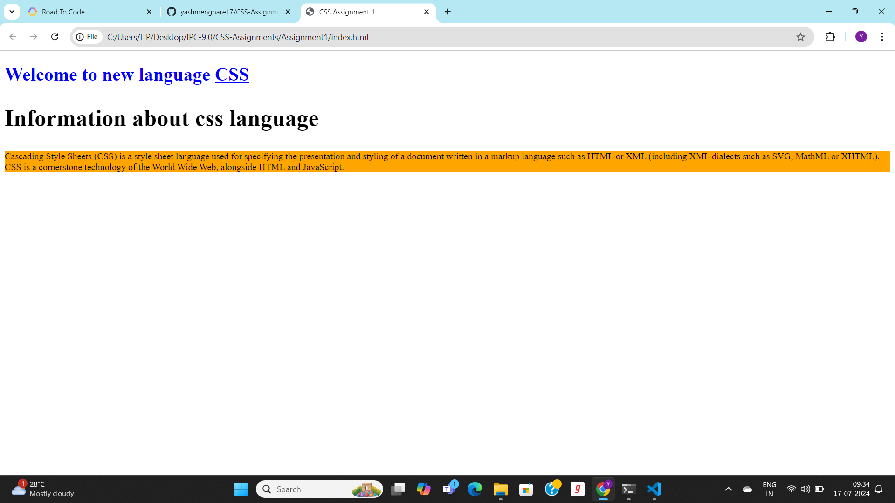
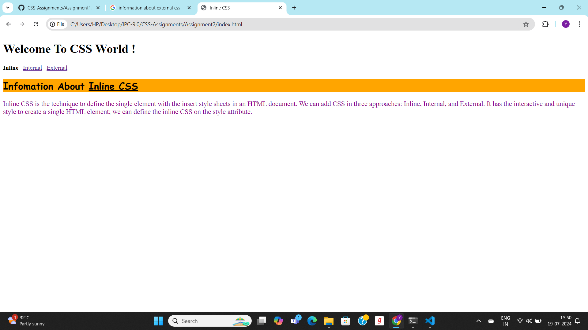
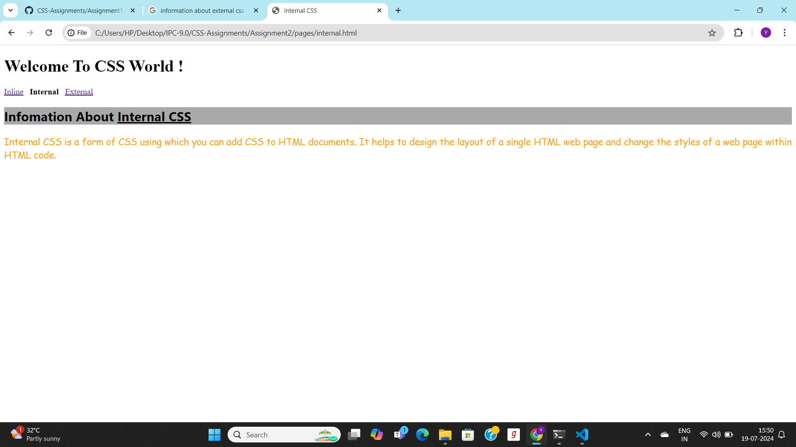
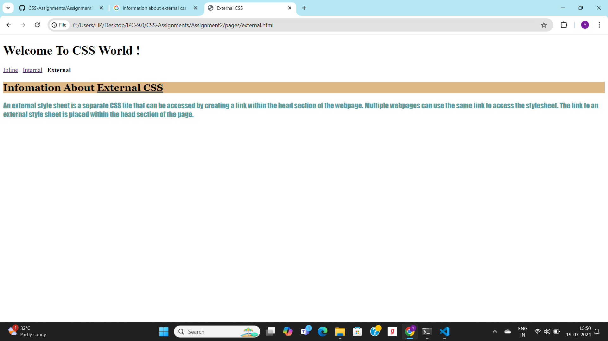
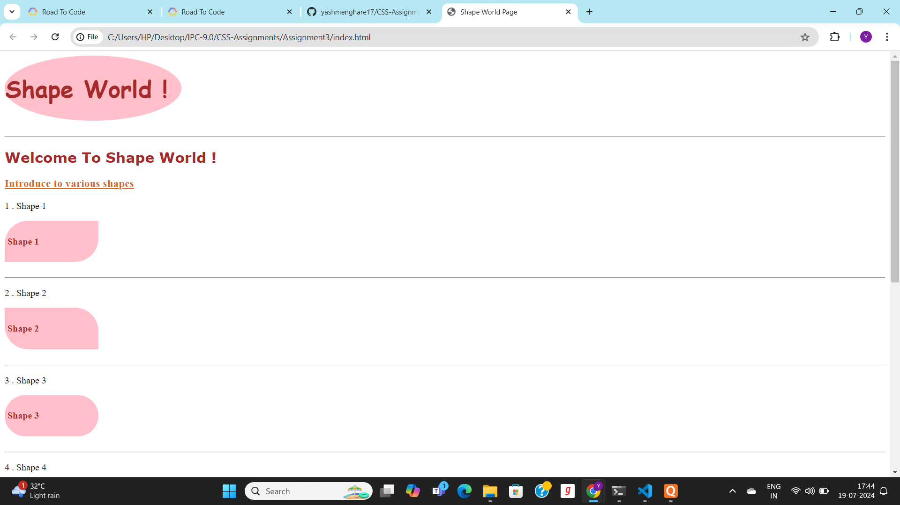
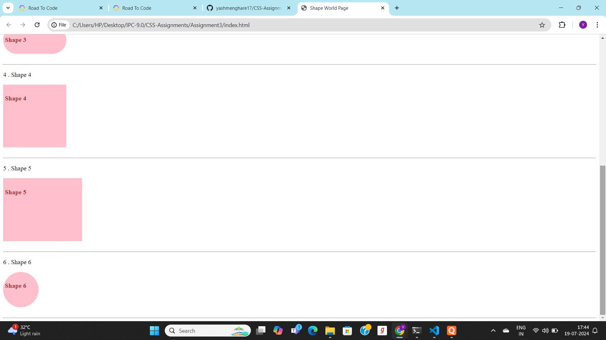

# CSS Assignments #
Welcome to **CSS Assignments !**

We have various assignments are as follow :
- **Assignment 1**
- **Assignment 2**
- **Assignment 3**

## **Assignment 1** ##

## Information About Assignment 1 ##

- **Summery Of Page** : This is an index page .That page content information about CSS language.In this page various 
tags is used like style tag for styling the index page.Also use various selectors like tag,class and id selector etc.
In this page , use various css propertires like background-color ,color and font-size etc to make style the given page.
- **Language Used** : HTML 5, CSS

## **Assignment 2** ##

## Information About Assignment 2 ##

- **Summery Of Page** : This assignment content three pages i.e index.html,internal.html and external.html etc.We use three ways to implant css on wepages.i.e Inline,Internal and External CSS respectivly. We use various properties of css like background-color ,color and font-size etc to make style the given pages.
- **Language Used** : HTML 5, CSS

## **Assignment 3** ##

## Information About Assignment 3 ##

- **Summery Of Page** : This assignment content one page i.e index.html.We use three ways to implant css on wepages.i.e Inline,Internal and External CSS respectivly. We use various properties of css like background-color ,color ,font-size,border and border-radius etc to make style the given pages.
- **Language Used** : HTML 5, CSS